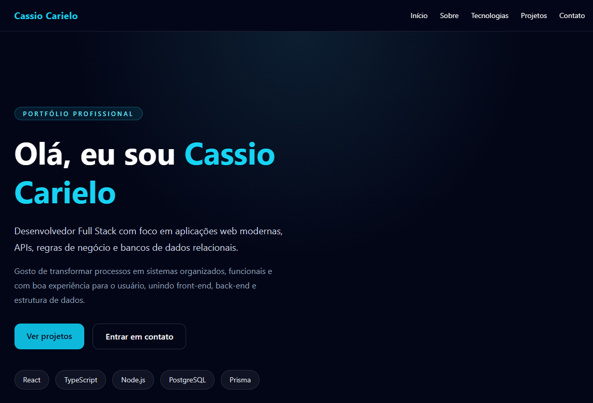

🚀 Portfolio - Cassio Carielo


Aplicação web desenvolvida com foco em apresentação profissional, organização de código e boas práticas de desenvolvimento front-end.

Este projeto tem como objetivo demonstrar minhas habilidades como desenvolvedor Full Stack, utilizando tecnologias modernas para construção de interfaces e estrutura de aplicações.

🧑‍💻 Sobre o projeto

Este portfólio foi desenvolvido para apresentar:

- Experiência com React + TypeScript
- Organização de código em componentes reutilizáveis
- Separação de responsabilidades (UI, dados e tipos)
- Uso de Tailwind CSS para estilização moderna
- Estrutura escalável de projeto

🛠️ Tecnologias utilizadas

- React
- TypeScript
- Tailwind CSS
- Vite

## 📁 Estrutura do projeto

```bash
src/
  components/   # Componentes reutilizáveis
  data/         # Dados centralizados
  types/        # Tipagens TypeScript
  App.tsx
  main.tsx

## ✨ Funcionalidades
- Layout responsivo
- Navegação por seções (scroll)
- Componentização reutilizável
- Estrutura organizada para manutenção e escalabilidade
- Apresentação de projetos e tecnologias

📸 Preview



🔗 Acesse o projeto
- 🌐 Deploy:
- 💻 GitHub: https://github.com/carielocas-ux/portfolio-cassiocarielo

📌 Projetos em destaque
- Sistema de Bolão da Copa
- Dashboard Administrativo
- API com regras de negócio

📬 Contato
- GitHub: https://github.com/carielocas-ux
- LinkedIn: https://www.linkedin.com/in/cassiocarielo
- Email: carielocas@gmail.com

📄 Licença

Este projeto está sob a licença MIT.
```

```

```
